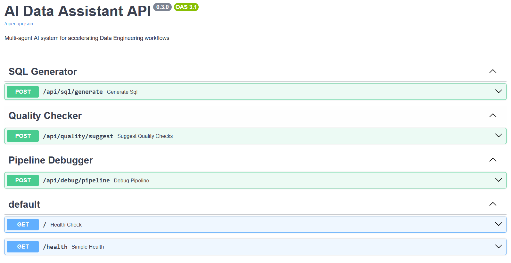
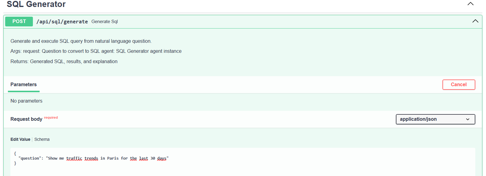
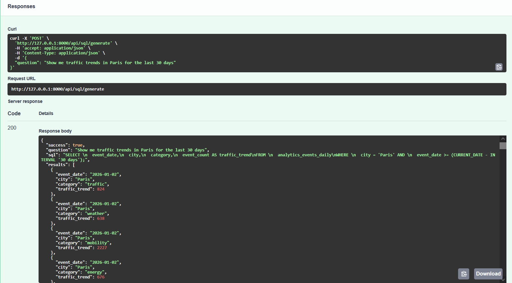
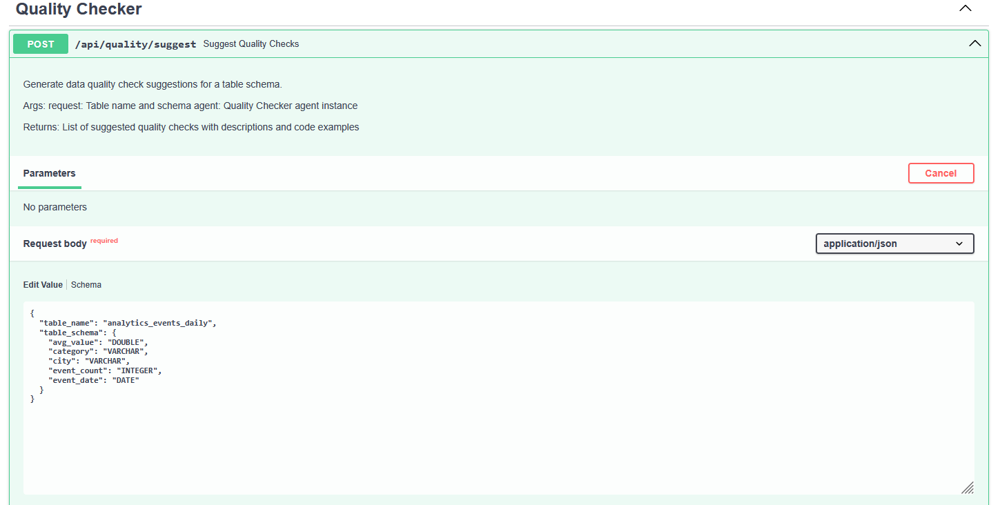
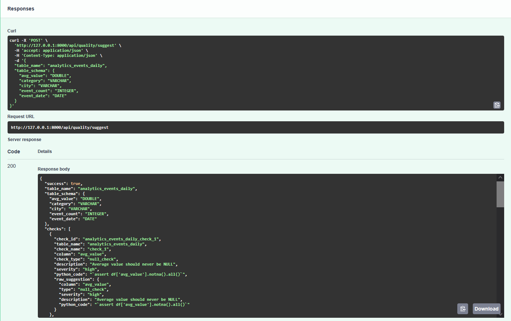
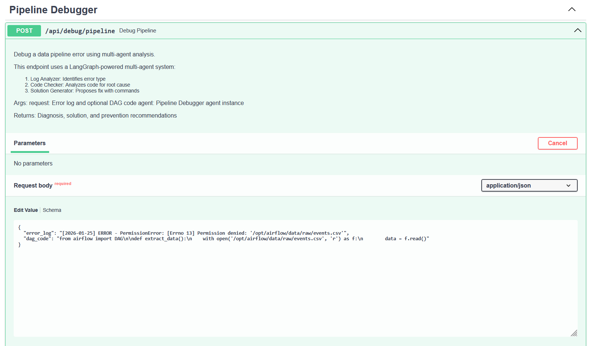
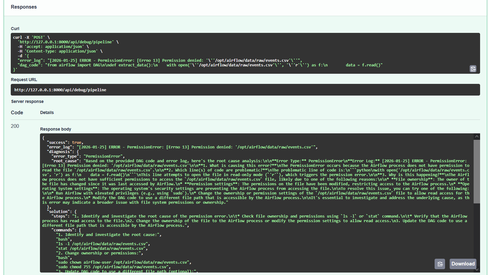
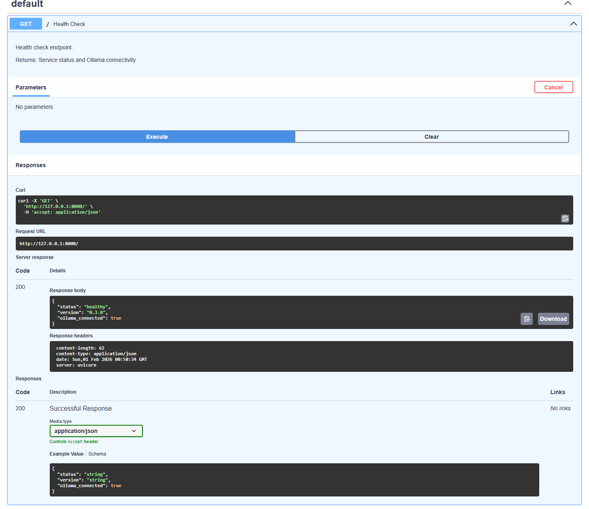

# AI-Powered Data Assistant

Multi-agent AI system for accelerating Data Engineering workflows.



## Status
✅ **Production Ready** - All 3 agents functional with 41 passing tests

## Features

### ✅ Implemented Agents

#### 1. SQL Query Generator
Transform natural language questions into SQL queries.




**Example:**
```
Question: "Show me traffic trends in Paris for the last 30 days"
→ Generates SQL
→ Executes query
→ Returns results with explanation
```

#### 2. Quality Check Suggestor
Analyze table schemas and suggest data quality checks with Python code.




**Example:**
```
Input: Table schema (column names + data types)
→ Suggests quality checks
→ Provides Python code for each check
→ Assigns severity levels (critical, high, medium, low)
```

#### 3. Pipeline Debugger (Multi-Agent)
Debug data pipeline errors using **LangGraph-orchestrated multi-agent system**.




**Architecture:**
```
Error Log + DAG Code
        ↓
┌─────────────────────┐
│ 1. Log Analyzer     │ → Identifies error type
└─────────────────────┘
        ↓
┌─────────────────────┐
│ 2. Code Checker     │ → Analyzes root cause
└─────────────────────┘
        ↓
┌─────────────────────┐
│ 3. Solution Generator│ → Proposes fix with commands
└─────────────────────┘
        ↓
  Complete Solution
```

### Health Monitoring



API provides health endpoints to monitor:
- Service status
- Ollama connectivity
- API version

## Stack

- **Python 3.12** - Modern Python with type hints
- **FastAPI** - High-performance REST API framework
- **LangGraph** - Multi-agent orchestration
- **Ollama + llama3.1** - Local LLM (free, no API keys)
- **DuckDB** - Embedded analytical database
- **pytest** - Testing framework (41 tests)
- **uv** - Fast Python package manager

## Quick Start

### Prerequisites

**1. Install Ollama**
```bash
curl -fsSL https://ollama.com/install.sh | sh
```

**2. Pull llama3.1 model**
```bash
ollama pull llama3.1
```

**3. Start Ollama server**
```bash
ollama serve
```

### Installation
```bash
# Clone repository
git clone <your-repo-url>
cd demo-ai-data-assistant

# Install dependencies with uv
uv sync --extra dev

# Copy environment template
cp .env.example .env

# Edit .env with your Ollama URL (default: localhost:11434)
# If VM → PC setup: OLLAMA_BASE_URL=http://192.168.x.x:11434
```

### Create Sample Data
```bash
# Create enriched DuckDB database (1200 rows)
uv run python scripts/create_sample_data.py
```

**Note:** The script generates 60 days of data across 5 cities and 4 categories. This enables rich demo queries like "Show me traffic trends in Paris for the last 30 days".

### Run API Server
```bash
# Start FastAPI server
uv run uvicorn api.main:app --reload --host 0.0.0.0 --port 8000
```

**Access Swagger UI:** http://localhost:8000/docs

## API Endpoints

### `GET /`
Health check with Ollama connectivity status

**Response:**
```json
{
  "status": "healthy",
  "version": "0.3.0",
  "ollama_connected": true
}
```

### `POST /api/sql/generate`
Generate and execute SQL from natural language

**Request:**
```json
{
  "question": "Show me traffic trends in Paris for the last 30 days"
}
```

**Response:**
```json
{
  "success": true,
  "question": "Show me traffic trends in Paris for the last 30 days",
  "sql": "SELECT event_date, event_count FROM analytics_events_daily WHERE city = 'Paris' AND category = 'traffic' AND event_date >= (CURRENT_DATE - INTERVAL '30 days')",
  "results": [
    {"event_date": "2026-01-02", "event_count": 824},
    {"event_date": "2026-01-03", "event_count": 638}
  ],
  "row_count": 30,
  "explanation": "This query retrieves traffic events for Paris..."
}
```

### `POST /api/quality/suggest`
Generate data quality check suggestions

**Request:**
```json
{
  "table_name": "analytics_events_daily",
  "table_schema": {
    "event_date": "DATE",
    "city": "VARCHAR",
    "category": "VARCHAR",
    "event_count": "INTEGER",
    "avg_value": "DOUBLE"
  }
}
```

**Response:**
```json
{
  "success": true,
  "table_name": "analytics_events_daily",
  "checks": [
    {
      "check_id": "analytics_events_daily_check_1",
      "check_name": "city_not_null",
      "column": "city",
      "check_type": "null_check",
      "severity": "high",
      "description": "City should never be NULL",
      "python_code": "assert df['city'].notna().all()"
    },
    {
      "check_id": "analytics_events_daily_check_2",
      "check_name": "event_count_positive",
      "column": "event_count",
      "check_type": "range_check",
      "severity": "high",
      "description": "Event count should be greater than or equal to 0",
      "python_code": "assert (df['event_count'] >= 0).all()"
    }
  ],
  "check_count": 6
}
```

### `POST /api/debug/pipeline`
Debug pipeline errors with multi-agent analysis

**Request:**
```json
{
  "error_log": "[2026-01-25] ERROR - PermissionError: [Errno 13] Permission denied: '/opt/airflow/data/raw/events.csv'",
  "dag_code": "from airflow import DAG\n\ndef extract_data():\n    with open('/opt/airflow/data/raw/events.csv', 'r') as f:\n        data = f.read()"
}
```

**Response:**
```json
{
  "success": true,
  "diagnosis": {
    "error_type": "PermissionError",
    "root_cause": "File permissions issue for airflow user..."
  },
  "solution": {
    "steps": "1. Change ownership of the file...",
    "commands": [
      "sudo chown airflow:airflow /opt/airflow/data/raw",
      "sudo chmod 755 /opt/airflow/data/raw"
    ],
    "explanation": "This fixes the permissions by giving the airflow user access..."
  },
  "prevention": "Set correct permissions from the start...",
  "agent_workflow": [
    "Log Analyzer: Identified PermissionError",
    "Code Checker: Analyzed code for root cause",
    "Solution Generator: Generated fix"
  ]
}
```

## Testing

### Run all tests
```bash
uv run pytest
```

**Result:** 41 tests passing ✅

### Run specific test files
```bash
uv run pytest tests/test_sql_generator.py
uv run pytest tests/test_quality_checker.py
uv run pytest tests/test_debugger.py
uv run pytest tests/test_api.py
```

### Test agents directly
```bash
# Test SQL Generator
uv run python -m agents.sql_generator

# Test Quality Checker
uv run python -m agents.quality_checker

# Test Pipeline Debugger
uv run python -m agents.debugger
```

## Project Structure
```
demo-ai-data-assistant/
├── agents/              # AI Agents
│   ├── sql_generator.py # Agent 1: SQL Generator
│   ├── quality_checker.py # Agent 2: Quality Checker
│   └── debugger.py      # Agent 3: Multi-Agent Debugger (LangGraph)
├── api/                 # FastAPI application
│   ├── main.py         # App entry point
│   ├── models.py       # Pydantic request/response models
│   └── routers/
│       ├── sql.py      # SQL endpoints
│       ├── quality.py  # Quality endpoints
│       └── debugger.py # Debugger endpoints
├── config/              # Configuration
│   └── settings.py     # Pydantic settings
├── tests/               # Test suite (41 tests)
│   ├── conftest.py     # Pytest fixtures
│   ├── test_sql_generator.py
│   ├── test_quality_checker.py
│   ├── test_debugger.py
│   └── test_api.py
├── scripts/             # Utility scripts
│   └── create_sample_data.py
├── docs/                # Documentation
│   └── screenshots/    # API screenshots
├── data/                # Data files (gitignored)
├── .env.example        # Environment template
├── demo_examples.md    # Demo examples for testing
└── pyproject.toml      # Dependencies
```

## Configuration

### Local Setup (Default)
```bash
OLLAMA_BASE_URL=http://localhost:11434
OLLAMA_MODEL=llama3.1
DUCKDB_PATH=data/sample_warehouse.duckdb
```

### Network Setup (VM → PC with GPU)
If running on VM and Ollama on separate PC:
```bash
OLLAMA_BASE_URL=http://192.168.x.x:11434  # Replace x.x with PC IP
OLLAMA_MODEL=llama3.1
DUCKDB_PATH=data/sample_warehouse.duckdb
```

## Architecture Deep Dive

### Why Multi-Agent for Pipeline Debugger?

**Traditional Approach (Single LLM Call):**
- Large prompt with all context
- LLM can miss details or get confused
- Lower quality solutions

**Multi-Agent Approach (LangGraph):**
- Each agent specializes in one task
- Agents share state and build on findings
- Higher quality, more structured solutions
- Modular and extensible

### Agent Responsibilities

**Agent 1 (Log Analyzer):**
- Input: Error log
- Output: Error type (PermissionError, ImportError, etc.)
- Expertise: Pattern recognition in logs

**Agent 2 (Code Checker):**
- Input: Error type + DAG code
- Output: Root cause analysis
- Expertise: Code analysis and debugging

**Agent 3 (Solution Generator):**
- Input: Error type + Root cause
- Output: Solution steps + Shell commands + Prevention tips
- Expertise: DevOps and system administration

## What I Learned

### Multi-Agent Orchestration
- Built a LangGraph-powered multi-agent system
- Each agent specializes in one task (separation of concerns)
- Agents share state via TypedDict and collaborate sequentially
- Better results than single large prompts

### LLM Integration
- Integrated Ollama for local, cost-free LLM inference
- Prompt engineering for structured outputs
- Parsing and validating LLM responses
- Error handling and fallback strategies

### API Design
- RESTful API with FastAPI
- Pydantic models for request/response validation
- Dependency injection for settings and agents
- Auto-generated OpenAPI documentation (Swagger UI)

### Testing Strategy
- Unit tests with mocked LLM calls (no API dependency)
- Integration tests for end-to-end workflows
- Test fixtures for reusable test data
- 41 tests covering all agents and endpoints

### Data Engineering Best Practices
- SQL query generation from natural language
- Data quality check automation
- Pipeline error diagnosis and resolution
- Local development with embedded databases

## Demo Examples

See `demo_examples.md` for ready-to-use examples for each endpoint.

## License

MIT

---

**Built with ❤️ for Data Engineering workflows**